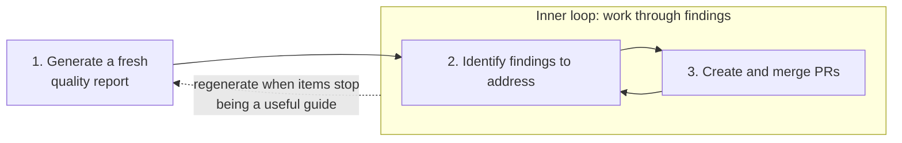

# Working through quality-report findings

From its start, openjd-rs has been developed with agentic AI as a primary
collaborator, and the single most valuable property the codebase can have
under that model is **self-consistency** — specs that describe what the
code actually does, comments that match the behavior, tests that exercise
what the specs say. When all three line up, people and agents can
ground themselves by reading the relevant spec into context and trust what
it says, instead of paging through hundreds or thousands of lines of
source to reconstruct ground truth. That is a multiplicative speedup:
every subsequent question, change, or review is faster because the cheap
source of truth is reliable.

The same logic generalizes across the other axes the [eval-crate
skill](../../skills/eval-crate/SKILL.md) examines — error-message quality,
naming consistency, public-API ergonomics, test coverage of edge cases,
faithfulness to the Python reference. Each one is cheap to maintain
incrementally and expensive to reconstruct after it has decayed. As long
as a crate is still acquiring small inconsistencies faster than they're
being addressed, attention has to stay on those: they crowd out
higher-level work. Once a crate clears a high bar on the basics, the
nature of useful review shifts upward. A developer or agent reading
the specs stops finding "this paragraph lies" and starts finding "this
whole subsystem could be simpler", "two crates grew the same abstraction
independently", or "this hot path is doing redundant work that an
algorithmic change would erase". New features land more easily for the
same reason: when you aren't constantly tripping over small papercuts,
it's easier to think about a proposed feature at the RFC level — to
reason about how it fits the existing design and what it would look like
across specs, code, and tests — instead of getting absorbed in
reconciling drift before you can even evaluate the idea. Those are the
findings and the changes that move a crate from "correct" to "good",
and they are only legible against a baseline where the small stuff has
already been handled.

The [report-driven
loop](../../DEVELOPMENT.md#report-driven-iteration-the-primary-quality-loop)
is how we clear and then maintain that bar. It is two nested loops:



The outer loop — when to retire a report and regenerate — is covered in
[regenerating-quality-reports.md](regenerating-quality-reports.md). This
document covers the inner loop: turning the current
`reports/<crate>-quality-evaluation-report.md` into a sequence of PRs that
triage, fix, and annotate what the report surfaced.

## Code, spec, and report changes go in one PR

Every PR that addresses a finding lands the code or spec change *and*
strikes through the corresponding line in the report, all in the same
diff:

```markdown
6. ~~**Decompose `validate_format_strings()`** into per-scope helpers.~~ **Resolved.**
```

This pairing matters. It helps a reviewer understand the intent of the
change, from both the report line being struck out and the changes to the
specs, and the change itself. A reviewer can read the strike-through to
understand what is being asserted, then verify the diff against that
assertion in a single pass. Without it, the connection between
"this change exists" and "this finding said to make it" is spread out
in more places that are hard to match up, making it harder to be
thorough and accurate in a review.

The convention also keeps the report honest as a living document. When the
next regeneration looks at the previous report, the strike-throughs tell
future-you which items the current code already reflects, so the next
report can be compared meaningfully against what was actually resolved
rather than what was just listed.

## Choosing which findings to focus on

Reports group their recommendations with a prioritization, and an
exploratory section for any bugs the agent identified through active
exploratory testing. Use the prioritization as a rough guideline, don't
rely on it. You likely know things that are not recorded in the
codebase, including fuzzy project priorities that change rapidly or are
hard to write down clearly.

Read more than just the recommendations, because sometimes the report
will describe something about the design or implementation that could be
dramatically improved, but describe it as if "that's just the way it
is." You might notice that and realize you can perform a powerful
refactoring of that detail. You should trust your instincts and use your
judgement, while keeping the following ideas in mind:

- **Get a feel for the whole report before committing to anything.**
  Read all of the findings and recommendations to form an
  overall impression: which items are genuinely important, which are
  cosmetic, which depend on each other, etc. A finding that looks small in isolation may
  be the cleanup that unlocks a larger one further down the list, and
  an item the report rates highly may turn out to be moot once you've
  read the next three.
- **Think about how big you want each PR to be.** If the solution to a
  finding looks ambiguous with tricky details to sort out, it likely
  should be its own PR. If there are a collection of simple findings,
  putting them into one PR will be more efficient. A single finding
  that turns out to be larger than expected once you start working can
  be split into a sequence of smaller PRs as you go. Aim for diffs that
  your reviewers will find approachable.
- **Fix spec/implementation inconsistencies early.** When the specs
  accurately describe the code, an agent working on subsequent findings
  can read the relevant spec into context and trust it instead of
  reverse-engineering ground truth from source. Closing that gap up
  front pays back across every later PR in the loop.
- **Don't feel obligated to clear the list.** A report is a snapshot.
  The goal is the loop, not the box-check. If the remaining items are
  polish on a module you're about to refactor, just regenerate after
  the refactor and let the next report decide whether they still
  matter.

It is fine — and often correct — to skip an item entirely if it has been
overtaken by other work, contradicts a more recent design decision, or is
simply not worth the change. Because we are repeating this cycle, important findings will appear
again in some future report.

## Addressing a finding (or several)

First understand what each finding claims is wrong, and how it is
suggesting we fix it. A finding may present multiple options. Then
think critically about both:

1. **Is the diagnosis correct?** The finding could overindex on
   something unimportant, apply good general advice where the specifics
   don't apply, or be wrong for any number of reasons.
2. **Is the prescription correct?** Consider alternatives to what the
   finding suggests, from doing a bigger cleanup to modifying the spec
   to clearly describe the current behavior with reasons why it is that
   way.

Treat the finding as a hypothesis to verify, not a checklist item.

Once you've decided what to do, a short prompt referencing the report by
section number is usually all the agent needs. A few shapes that work
well in practice:

- Straightforward, low-risk items that the report's prescription
  already handles correctly:

  > Implement the suggested resolutions for findings 3, 4, and 6 of
  > `reports/expr-quality-evaluation-report.md`.

- An item where you want the agent to broaden the scope beyond what the
  report literally lists — particularly useful for spec-drift findings,
  where the same drift often exists in places the per-crate scan
  didn't reach:

  > Implement a fix for finding 1 of the expr report, and make sure to
  > do a thorough scan of all the related code and documents to catch
  > any similar cases at the same time.

- An item where you've decided the prescription is wrong and want the
  agent to take a different approach, starting from a design pass on
  the specs before any code changes:

  > For finding 7 of the snapshots report, the recommended
  > non-exhaustive change doesn't seem right. Let's tackle it with the
  > builder-pattern instead. I'd like to do some design work first,
  > can you update just the specs to reflect a suggested change, then
  > let's iterate on that design before moving to implementation?

These are just suggestions. Use any and all approaches that work best
for you. For example you might start two separate agents in the same
workspace, and get them to analyze from different perspectives with
prompts like *"I got the suggestion '<copy/paste from other agent>' but
I'm not sure it's right. Can you critically analyze it against the
code?"*

[AGENTS.md](../../AGENTS.md) covers the convention of updating the specs
and the report in sync with the code change, but you may sometimes have
to remind the agent to double-check that the three actually line up.

## A worked example: clearing the previous `expr` report's P1 items

Before the regeneration described in
[regenerating-quality-reports.md](regenerating-quality-reports.md#finishing-the-worked-example-what-we-got-back),
the prior `expr` report opened with five P1 "Spec–implementation
synchronization" items. The primary cause was the profile refactor
(commit `98c8bdc feat(expr): introduce ExprProfile and FunctionLibrary::for_profile`),
which moved host-context registration off `FunctionLibrary::with_host_context` /
`with_unresolved_host_context` / `get_default_library` and onto
`ExprProfile + FunctionLibrary::for_profile` while leaving narrative
specs and a few inline doc comments describing the old API. A handful
of unrelated drifts surfaced in the same scan: a pair of
`FormatString::validate_*` signatures out of sync with `public-api.md`,
an `error-formatting.md` example referencing a constructor that doesn't
exist, and a stale inline comment about parser stack size.

This is a reasonable case for grouping. Five small items, one review
surface, one coherent diff. Commit `30f43ac docs: resync expr specs with
profile-based host-context API` landed all five together, and the report
edits in that PR struck each through individually:

```
specs/cli/run.md                          |   5 +-
specs/expr/architecture.md                |   3 +-
specs/expr/error-formatting.md            |  14 +++-
specs/expr/evaluator.md                   |   9 ++-
specs/expr/format-string.md               |  16 +++--
specs/expr/function-library.md            | 102 +++++++++++++++++++++---------
specs/expr/path-mapping.md                |  12 ++--
specs/expr/public-api.md                  |  12 ++--
specs/model/validation.md                 |  13 +++
crates/openjd-expr/src/eval/parse.rs      |   2 +-
crates/openjd-expr/src/format_string.rs   |  15 ++++-
crates/openjd-expr/src/default_library.rs |   4 +-
reports/expr-quality-evaluation-report.md |  34 ++++++----
```

The resolution annotation on item 1 noted that the fix went *wider* than
the report listed: the recommendation called out five spec docs, but the
PR caught the same drift in `specs/cli/run.md` and `specs/model/validation.md`
— which the report's per-crate scoping had missed. That extra scope is
captured in the resolution note rather than left implicit, and the next
regeneration of either crate's report sees no spec drift at all.

One of the five numbered items was purely an inline-comment fix: a
stale "8 MB worker-thread stack" comment that should say 32 MB (matching
`PARSER_THREAD_STACK_SIZE`). It got its own strike-through. The PR also
swept up two rustdoc references to the removed `with_host_context` API
in `format_string.rs` and `default_library.rs`; those weren't numbered
findings on their own but were adjacent to item 1's host-context
rewrite, so the resolution note for item 1 records that the fix went
slightly wider than the report listed. Folding both kinds of cleanup
into the same PR makes sense — small, related, same review surface,
same reviewer mental model.

After this PR all five P1 items were struck through, and what remained was
P2/P3 polish. That state is exactly what
[regenerating-quality-reports.md § *A worked example*](regenerating-quality-reports.md#a-worked-example-the-current-expr-report)
selected as the moment to retire and regenerate, and is the state the
regeneration in commit `fbcb480` started from.

## Knowing when to stop

Working through a report is not a march to zero. The right time to retire
the current report is *not* "all items resolved" — it's the moment the
remaining items have stopped being useful as a guide for what to work on
next. That judgment call, and the procedure for replacing the current
report, lives in
[regenerating-quality-reports.md](regenerating-quality-reports.md). When
you make that call, the strike-throughs you've left along the way become
the record of what was actually addressed in the interval — visible to
reviewers of the regeneration PR, and to anyone reading the git history
later.
